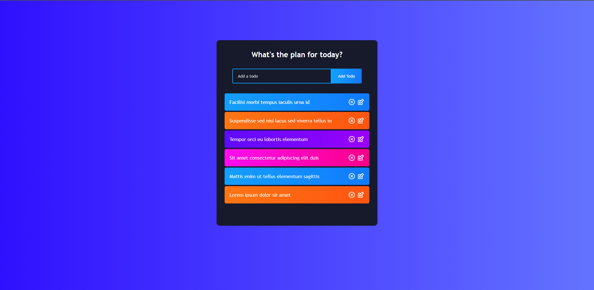

# ReactJS Todo List

This is a todo list app where the user can create a list of tasks to be completed. 
The user can add new items to the list by typing in the main input that is always focused so the user can create as many tasks as he wants without interruption. 
Tasks can be marked as completed with a single click and can also be removed. 
Finally the user can edit a todo item by clicking on the 'edit' icon and the app automatically focuses on the input field so the user doesn't have to click on it and can just start typing right away thus improving the user experience. 
The app features a modern layout and each item in the list gets automatically assigned a different color that rotates as more items are added to the list.

This web app was built with:
* ReactJS
* React Hooks
* react-icons

Click <a href="https://adtx.github.io/todo_list_reactjs/" target="_blank">here</a> to try out the app for yourself.
